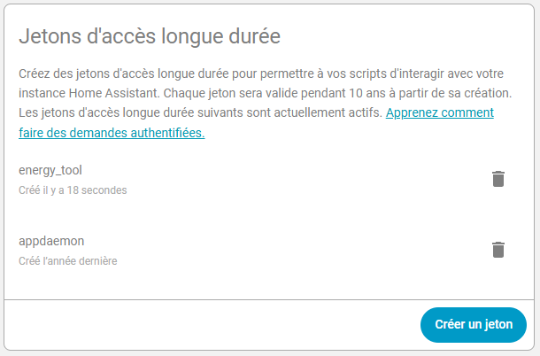
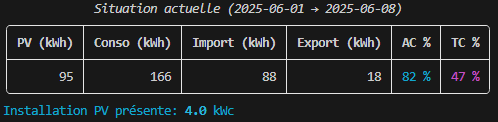
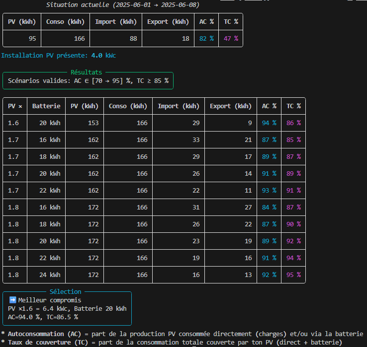
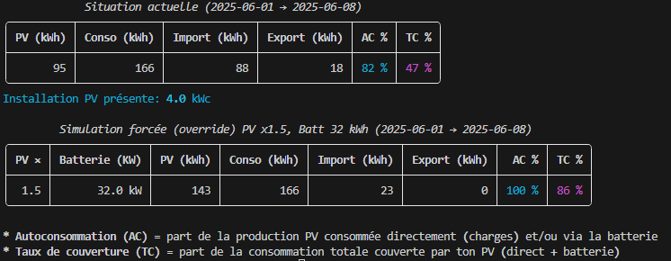
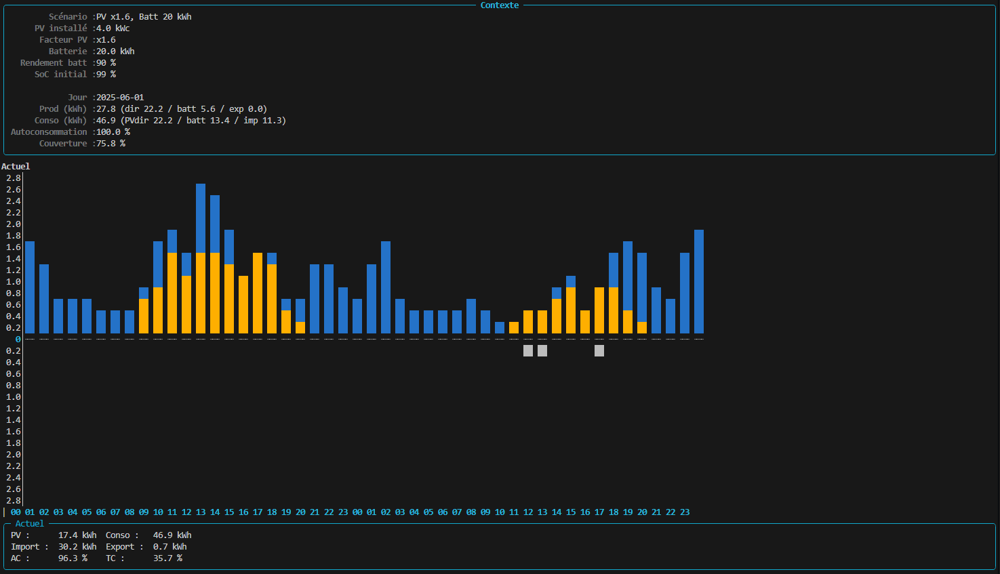
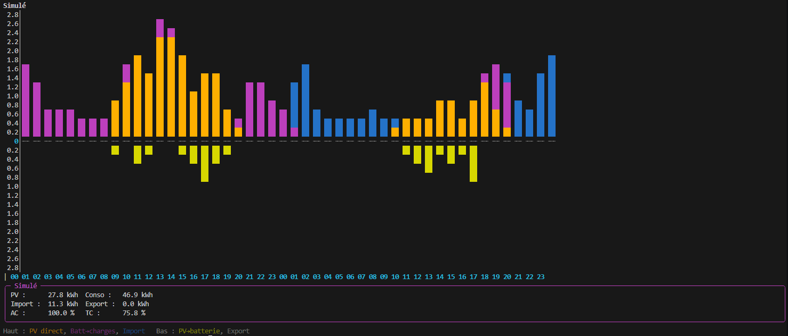
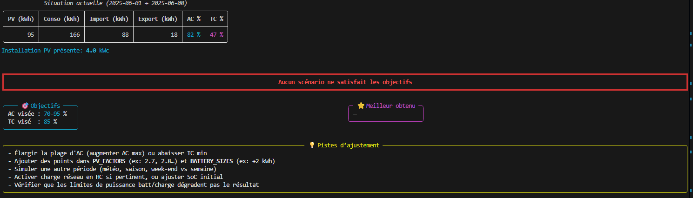
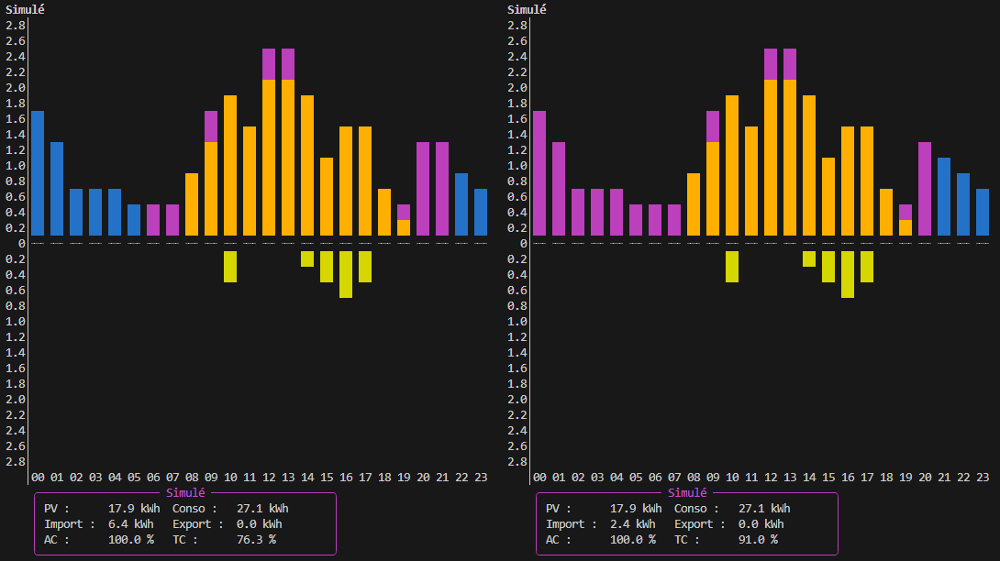

# Energy Tool

[](https://github.com/sinseman44/energy_tool/blob/main/LICENSE)
[](https://github.com/sinseman44/energy_tool/releases)
<br />

## Contexte

Dans le but de tendre vers une indépendance énergetique (partielle ou totale) de mon logement, j'ai réalisé ce simulateur d'energie permettant de quantifier _au plus juste_ mon besoin en production solaire et stockage d'énergie.<br />
Mon logement étant déjà équipé de panneaux photovoltaiques en autoconsommation avec revente de surplus, je me suis servi des données agrégées, au fil des mois, par mon système domotique (Home Assistant) pour créer ce simulateur.<br />
<br />Cet outil a pour but :
* de **récolter les données** de mon système domotique sur _une période de temps limitée_ (période d'étude).
* Sur cette période d'étude, de **définir le meilleur compromis** en terme d'ajout de _production solaire_ et _stockage d'énergie_ en fonction de mes objectifs en _autoconsommation_ et _taux de couverture_ (autosuffisance).
* Sur cette même période d'étude, de **simuler ce scénario** (meilleur compromis) ou **un scénario forcé** sur les données récoltées de mon système domotique.
* **D'afficher les résultats sous forme de graphes** avec un Avant (valeurs actuelles)/Après (valeurs simulées).

> [!WARNING]
> Cet outil doit être utilisé à titre informatif et ne peux pas répondre avec une grande précision aux besoins exprimés.

# Support

<a href="https://www.buymeacoffee.com/sinseman44" target="_blank"></a>

# Todo 📃 and Bug report 🐞

See [Github To Do & Bug List](https://github.com/sinseman44/energy_tool/issues)

# Définitions et formules
## Autoconsommation (AC)
> [!NOTE]
> Part de la production PV consommée sur place.

<br />C'est le pourcentage de la production PV **directement utilisée** pour couvrir la consommation locale, **sans passer par l'export réseau**.

### Formule
$AC\ =\ (PV\ utilisée\ sur\ place / PV\ totale)\ *\ 100$
<br />
* **PV totale** = somme de toute la production PV sur la période.
* **PV utilisée sur place** dépend du mode :
  * **En mode report (réel)** :<br />
$PV\ utilisée\ =\ PV\ totale\ -\ Export$
  * **En mode simulation** :<br />
$PV utilisée\ =\ \sum(pv\\_direct + batt\\_to\\_load)$

### Valeur attendue
* Toujours comprise entre **0%** et **100%**

## Taux de couverture (TC)
> [!NOTE]
> Part de la consommation couverte par le PV.<br />
> Plus cette valeur tend vers 100%, moins nous sommes dépendants du réseau électrique.

<br />C'est le pourcentage de la consommation locale qui **provient de la production photovoltaique** (directement ou via batterie).

### Formule
$TC\ =\ (PV\ utilisée\ sur\ place / Consommation\ totale)\ *\ 100$
<br />
* **Consommation totale** = somme de la demande énergétique sur la période.
* **PV utilisée sur place** = identique à celle utilisée pour le calcul de l'AC:
  * **En mode report (réel)** :<br />
$PV\ utilisée\ =\ PV\ totale\ -\ Export$
  * **En mode simulation** :<br />
$PV utilisée\ =\ \sum(pv\\_direct + batt\\_to\\_load)$
 
### Valeur attendue
* Toujours comprise entre **0%** et **100%**

## Import
électricité prise au réseau

## Export
surplus injecté au réseau

# Fonctionnalités
* **Report** (mode `report`) : récupère l’historique PV/Conso, calcule import/export horaire et journalier.
* **Simulation** (mode `simu`) : parcourt un espace de scénarios PV (facteur) × batteries selon vos objectifs (AC/TC), et produit le meilleur compromis.
* **Plot** (mode `plot`) :
  * graphe horaire bipolaire (consommation en haut / production en bas),
  * comparatif Avant/Après pour un jour donné,
  * affichage multi-jours (24 h / 48 h …) avec empilement vertical.

# Prérequis
* Python 3.10+
* Home Assistant (optionnel, si vous utilisez la source `ha_ws`)
* Un _long-lived access token_ Home Assistant (si vous utilisez la source `ha_ws`)

* Paquets principaux Python:
  * `websocket-client`, `rich`

```bash
pip install -r requirements.txt
```

# Installation
Placez les fichiers dans un dossier de travail, par exemple :
```bash
energy_tool.py
cli_output.py
ha_ws_api.py
pv_config.json
```

# Sources pour le mode `report`
Par défaut, l'outil a été initialement pensé pour récupérer les données via Home Assistant car celui-ci agrége mes données de production et de consommation électrique depuis que mon installation photovoltaique a été physiquement installée.<br />
Il serait possible d'utiliser d'autres sources de données pour utiliser l'outil comme par exemple :
* un fichier CSV (eg: EDF)
* une API propriétaire du constructeur des onduleurs/micro-onduleurs (eg: enlighten)
* etc ...

## Home Assistant
Il existe deux possibilités de communiquer avec Home Assistant depuis un outil externe:
* une [API WebSocket](https://developers.home-assistant.io/docs/api/websocket/)
* une [API REST](https://developers.home-assistant.io/docs/api/rest)

Le choix s'est porté sur l'API WebSocket d'Home Assistant et donc l'implémentation d'un client WebSocket sur ce simulateur.
Pour communiquer avec Home Assistant, nous avons besoin d'une URI formalisée de cette manière :
* en local :
```bash
ws://<ADRESSE_IP_LOCALE>:8123/api/websocket
```
* a distance :
```bash
wss://<ADRESSE_SERVEUR_DOMOTIQUE>/api/websocket
```
Cette adresse doit être renseignée dans le fichier de configuration JSON:
```json
  "BASE_URL": "ws://homeassistant:8123/api/websocket"
```
<br />

L'autentification sur le système domotique se fait grâce à un [jeton d'accès longue durée](https://developers.home-assistant.io/docs/auth_api/#long-lived-access-token).<br />
Il se crée facilement sur la page de sécurité du compte associé d'Home Assistant et doit être renseigné dans le fichier de configuration JSON:
```json
  "TOKEN": "XXXXXXXXXXXX"
```
<br />

Finalement, deux entités sont nécessaires pour récupérer les données de production et de consommation et doivent être renseignées dans le fichier de configuration JSON, respectivement les étiquettes `PV_ENTITY` et `LOAD_ENTITY`.<br />

Par exemple pour un système Enphase, ces 2 entités ont ce formalisme :
`sensor.envoy_XXXXXXXXXXXX_production_d_energie_totale` et `sensor.envoy_XXXXXXXXXXXX_consommation_d_energie_totale`.

## Fichier CSV
Il est possible de choisir la source `csv` pour le mode `report`.<br />
Le fichier de configuration JSON doit contenir l'attribut :
```json
  "IN_CSV": "<CHEMIN DU FICHIER JSON>"
```
<br />

Le fichier CSV doit contenir les attributs suivant et doit contenir les données par pas de 1h :
* _date_ : date et heure au format ISO "YYYY-MM-DDTHH:MM"
* _pv\_diff_ : la production totale en kWh pour la période `date`
* _load\_diff_ : la consommation totale en kWh pour la période `date`

Exemple :
```csv
date,pv_diff,load_diff
2025-06-01 00:00,0.0,1.687
2025-06-01 01:00,0.0,1.128
2025-06-01 02:00,0.0,0.673
2025-06-01 03:00,0.0,0.609
2025-06-01 04:00,0.0,0.524
2025-06-01 05:00,0.0,0.458
2025-06-01 06:00,0.0,0.495
2025-06-01 07:00,0.035,0.446
2025-06-01 08:00,0.61,0.852
2025-06-01 09:00,0.789,1.59
2025-06-01 10:00,1.397,1.755
2025-06-01 11:00,1.009,1.493
2025-06-01 12:00,1.323,2.447
2025-06-01 13:00,1.356,2.422
2025-06-01 14:00,1.296,1.837
2025-06-01 15:00,0.971,1.068
2025-06-01 16:00,1.365,1.418
2025-06-01 17:00,1.119,1.311
2025-06-01 18:00,0.473,0.615
2025-06-01 19:00,0.163,0.512
2025-06-01 20:00,0.019,1.266
2025-06-01 21:00,0.0,1.183
2025-06-01 22:00,0.0,0.708
2025-06-01 23:00,0.0,0.648
```

## API propriétaire (Enlighten)
Work In Progress !!

# Configuration
Tout passe par un unique JSON (ex. `pv_config.json`)
<br />
Exemple minimal à adapter à vos valeurs :
```json
{
  "BASE_URL": "wss://votre-ha/api/websocket",
  "TOKEN": "XXXXXXXX",
  "IN_CSV": "mon_fichier_source.csv"
  "PV_ENTITY": "sensor.envoy_xxx_production_d_energie_totale",
  "LOAD_ENTITY": "sensor.envoy_xxx_consommation_d_energie_totale",

  "START": "2025-03-01T00:00:00",
  "END":   "2025-04-01T00:00:00",

  "OUT_CSV_DETAIL": "ha_energy_import_export_hourly.csv",
  "OUT_CSV_DAILY":  "ha_energy_import_export_daily.csv",
  "OUT_CSV_SIMU":   "ha_energy_simulation_combos.csv",

  "PV_ACTUAL_KW": 4.0,

  "TARGET_AC_MIN": 85.0,
  "TARGET_AC_MAX": 95.0,
  "TARGET_TC_MIN": 75.0,

  "BATTERY_EFF": 0.90,
  "BATTERY_SIZES": [0,5,10,12,14,16,18,20,22,24,26,28,30],
  "PV_FACTORS":   [1.0,1.2,1.5,1.8,2.0,2.2,2.4,2.6,3.0],

  "ALLOW_DISCHARGE_IN_HC": true,
  "GRID_CHARGE_IN_HC": true,
  "GRID_HOURS": [22,23,0,1,2,3,4,5],
  "GRID_TARGET_SOC": 0.80,
  "GRID_CHARGE_LIMIT": 3.0,

  "INITIAL_SOC": 0.50,
  "BATT_MIN_SOC": 0.10,

  "MAX_CHARGE_KW_PER_HOUR": 0.0,
  "MAX_DISCHARGE_KW_PER_HOUR": 0.0
}
```
## Champs importants
* **BASE_URL/TOKEN**: connexion Home Assistant (mode `report` avec la source `ha_ws`).
* **IN_CSV**: utilisation d'un fichier CSV (mode `report` avec la source `csv`)
* **PV_ENTITY/LOAD_ENTITY**: L'entité de production totale et de consommation totale d'Home Assistant (mode `report` avec la source `ha_ws`).
* **START/END**: fenêtre d'étude (ISO local sans `Z` pour éviter les décalages).
* **TARGET_AC_MIN/TARGET_AC_MAX/TARGET_TC_MIN**: objectifs de sélection des scénarios pour l'autoconsommation et le taux de couverture (mode `simu`).
* **BATTERY_EFF/BATTERY_SIZES/PV_FACTORS**: grille de recherche de scénarios (mode `simu`).
* **ALLOW_DISCHARGE_IN_HC**: autorise la décharge de la batterie en heures creuses (mode `simu`).
* **GRID_CHARGE_IN_HC**: autorise la charge de la batterie en heures creuses (mode `simu`).
* **GRID_HOURS**: heures creuses (mode `simu`).
* **GRID_TARGET_SOC**: Jusqu'à quel niveau de charge, on souhaite remonter la batterie (mode `simu`).
* **GRID_CHARGE_LIMIT**: La puissance maximale de recharge par heure, en kWh (mode `simu`).
* **INITIAL_SOC**: état de charge initial de la batterie pour la période d'étude.
* **BATT_MIN_SOC**: réserve non déchargeable de la batterie.
* **DISCHARGE_KW_PER_HOUR**: limites (kWh par pas horaire). `0` = illimité

> [!NOTE]
> Vous pouvez forcer le scénario de simulation (PV et batterie) via le JSON en posant par ex. `SIM_OVERRIDE: {"pv_factor": 2.4, "batt_kwh": 24}`.

# Lancer l'outil
## Rapport (extraction et calculs)
```bash
python3 energy_tool.py --mode report --config pv_config.json --source ha_ws
```
ou depuis un CSV déjà exporté :
```bash
python3 energy_tool.py --mode report --config pv_config.json --source csv
```
Exemple d'affichage :<br />


## Simulation (sélectionne les scénarios qui atteignent les objectifs)
```bash
python3 energy_tool.py --mode simu --config pv_config.json
```
Exemple d'affichage :<br />


### Simulation forcée (Scénario forcé dans le fichier de configuration JSON)
```bash
python3 energy_tool.py --mode simu --config pv_config.json --override true
```
Exemple d'affichage :<br />
```json
  "SIM_SCENARIO": {
    "PV_FACTOR": 1.5,
    "BATTERY_KWH": 32
  }
```


## Graphes (plot)
* Bipolaire simple (un CSV, un jour):
```bash
python3 energy_tool.py --mode plot --config pv_config.json --day 2025-06-01
```
Exemple d'affichage :<br />


* Comparatif Avant/Après
```bash
python3 energy_tool.py --mode plot --config pv_config.json --day 2025-06-01 --days 2
```
Exemple d'affichage :<br />



> [!NOTE]
> Les graphes utilisent `Rich` : couleurs, panneaux de contexte (puissance PV, scénario, SoC initial, AC/TC, etc.).

# Sorties générées
## Simulation echouée
Il est possible _qu'aucun scénario_ ne satisfait pas **les objectifs d'AC et TC** définis dans le fichier de configuration JSON pour une simulation non forcée sur la période définie par `report`.<br />
Cela peut-être dû à plusieurs facteurs, exemple:
* objectif d'autoconsommation (AC) trop contraint.
* objectif de taux de couverture (TC) trop élevé.
  * Si, par exemple, on n'autorise pas la décharge de la batterie en HC, cela aura pour conséquence de faire chuter le TC.
* la fourchette de tailles de batteries n'est pas suffisament grande.
* la fourchette de facteurs multiplicateurs de PV n'est pas suffisament grande.
<br />



## Simulation décharge ou non en Heures Creuses
Par défaut, la batterie déchargera automatiquement en Heures Pleines pour atteindre les objectifs d'autoconsommation et de taux de couverture, mais il est possible d'améliorer les résultats en déchargeant aussi la batterie en Heures Creuses à l'aide du paramètre `ALLOW_DISCHARGE_IN_HC` dans la configuration.
Exemple : Pour le même scénario :
* Vue de gauche : Sans décharge de la batterie en HC.
* Vue de droite : Avec décharge de la batterie en HC.
<br />

> [!NOTE]
> On remarque que le TC évolue en autorisant la décharge de la batterie en HC.<br />
> On remarque également que le facteur multiplicateur choisi n'est pas suffisant pour couvrir toute la consommation du logement sur ce jour.<br />
> On remarque que la production photovoltaique simulée n'a pas été suffisante pour recharger la batterie et ainsi couvrir tous les besoins de la journée.<br /> 
<br />



# Modèle de simulation
**Pour chaque heure h** :
1. PV → charges directes : `pv_direct = min(pv[h], load[h])`
2. Batterie → charges : borné par SoC – réserve et `MAX_DISCHARGE_KW_PER_HOUR`
3. Import = reste de charge si non couvert
4. PV → batterie (stockage) : borné par capacité restante et `MAX_CHARGE_KW_PER_HOUR`
5. Export = surplus PV non stocké/consommé
6. Recharge réseau (HC) si activée, vers `GRID_TARGET_SOC` sans dépasser `GRID_CHARGE_LIMIT` (kWh)

Paramètres clés :
* Rendement unique `BATTERY_EFF` pour charge/décharge.
* `BATT_MIN_SOC` (réserve) : fraction non déchargeable.
* `INITIAL_SOC` : SoC initial au début de la fenêtre (pas de reset journalier).
* Limites charge/décharge (kWh/h) optionnelles.

## Scénarios envisagés pour la Charge/Décharge de la batterie en Heures Creuses

| `ALLOW_DISCHARGE_IN_HC` | `GRID_CHARGE_IN_HC` | Comportement |
|:-----------------------:|:-------------------:|--------------|
| **FALSE**               | **FALSE**           | **Ni charge, ni décharge** en HC -> tout vient du réseau             |
| **FALSE**               | **TRUE**            | **Recharge autorisée**, mais pas de décharge -> on remplit la batterie avec le réseau, toute la conso vient du réseau             |
| **TRUE**                | **FALSE**           | **Décharge autorisée**, mais pas de recharge -> la batterie allimente le load si disponible             |
| **TRUE**                | **TRUE**            | **Recharge et décharge autorisée**, priorité à la recharge             |

Dans une stratégie d'optimisation de l'autoconsommation pour les tarifs HC/HP:
* On met `GRID_CHARGE_IN_HC = true` pour profiter des HC pour charger avec le réseau et alimenter l'habitation avec le réseau.
* On met `ALLOW_DISCHARGE_IN_HC = false` pour éviter de vider la batterie en HC et maximiser l'autoconsommation.

# Graphes et console
